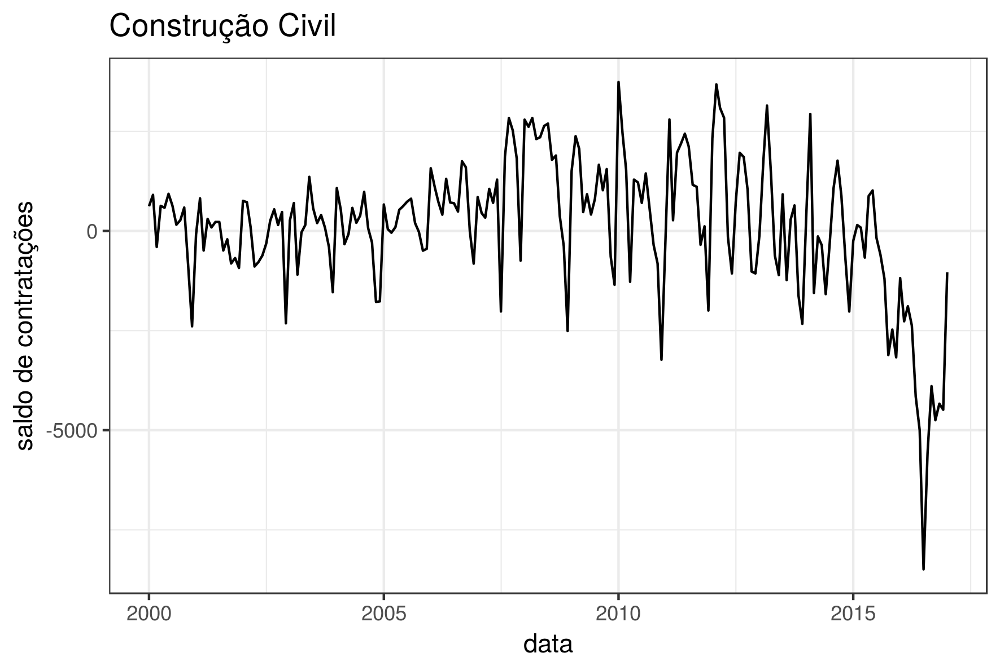
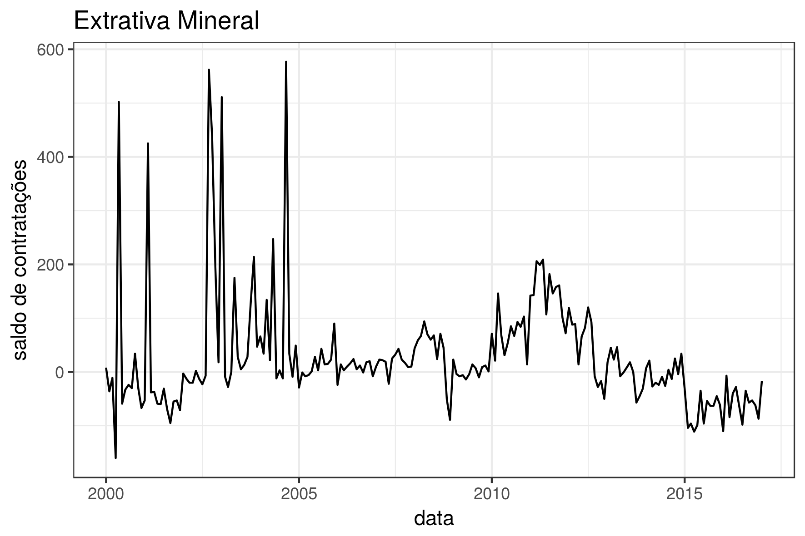

# 2017.03---Emprego---Rio

# Saldo de Admisssão e desligamentos de empregos no município do Rio de Janeiro

## Analise
#### bablabla:

[Como tem andando a taxa de empregos na cidade do Rio de Janeiro?]

Se tomarmos a área de construção civil como parâmetro para medir a taxa de empregos no Rio de Janeiro, observaremos um enorme e crescente declínio no último ano. 

Apesar dos discursos que impulsionaram a realização de mega eventos esportivos, que prometiam empregos duradouros e uma taxa de empregabilidade crescente, após o término das obras de infraestrutura observamos uma grande taxa de desemprego.  

Essa queda também se manifesta em diversos outros setores, como serviços, indústria de transformação e comércio. 

###### Saldo por tipo de emprego

## Metodologia

Os dados foram pre-processados e visualizados em R. O script usado está disponível [aqui](https://github.com/database-RJ/2017.03---Emprego---Rio/blob/master/admissao_desligamento.R).

## Fonte:

CAGED, via [Armazém de Dados](http://www.armazemdedados.rio.rj.gov.br/)
[link fixo pra tabela](http://www.armazemdedados.rio.rj.gov.br/arquivos/3175_cagedfev17.XLS)
