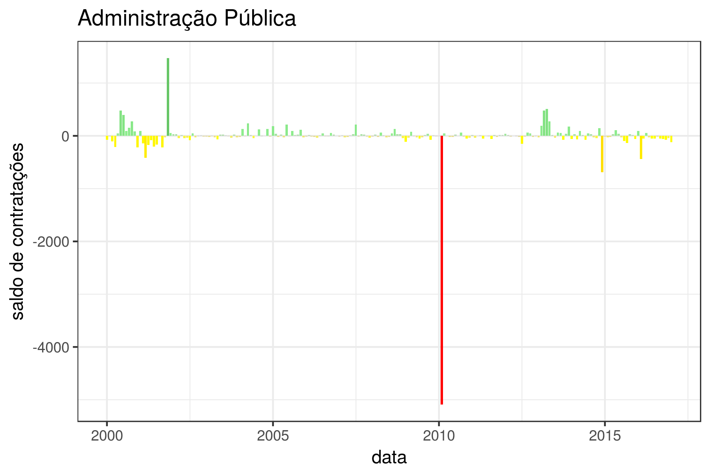
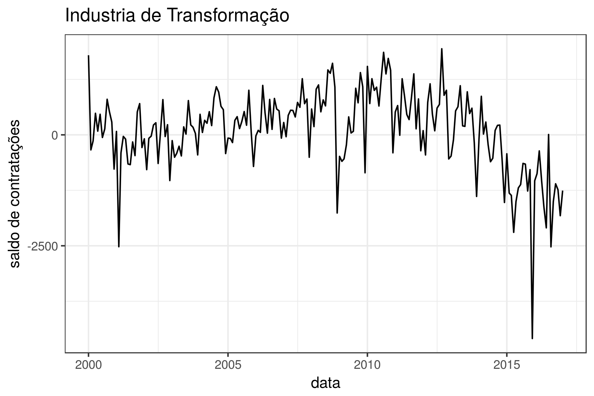
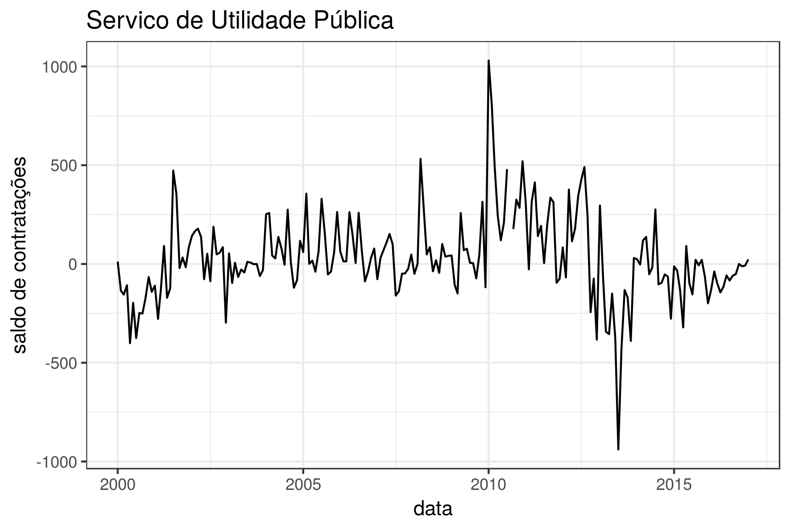
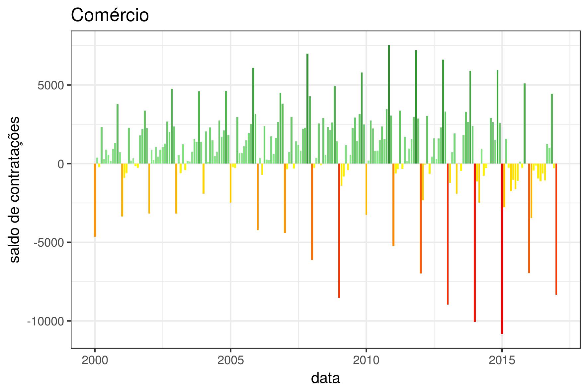
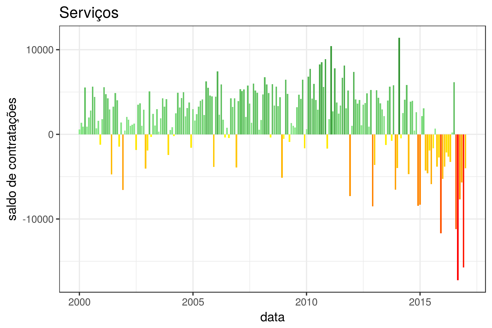
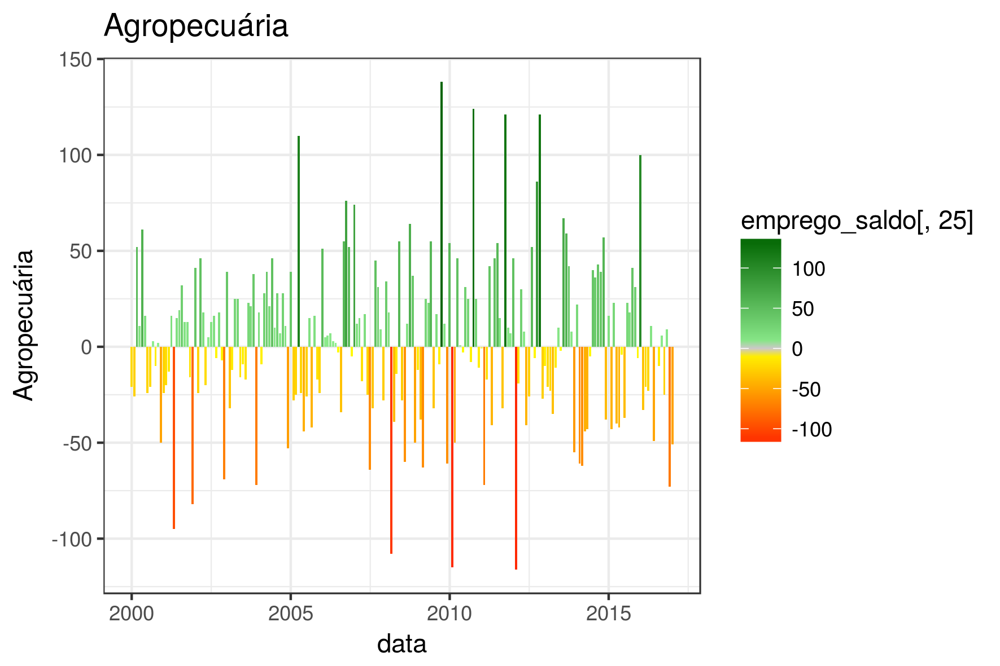

# 2017.03---Emprego---Rio

# Saldo de Admisssão e desligamentos de empregos no município do Rio de Janeiro

## Analise
#### bablabla:

blablabla

###### Saldo por tipo de emprego

##Metodologia

Os dados foram pre-processados e visualizados em R. O script usado está disponível aqui [links](https://drive.google.com/drive/folders/0B5p2DfLvQ-6RZ3Z0azlLeTljLWc?usp=sharing).

##Fonte:

###CAGED
